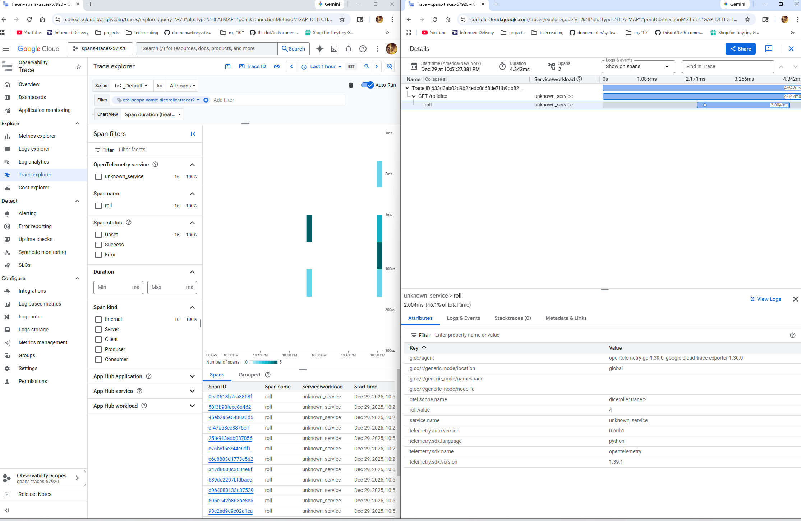
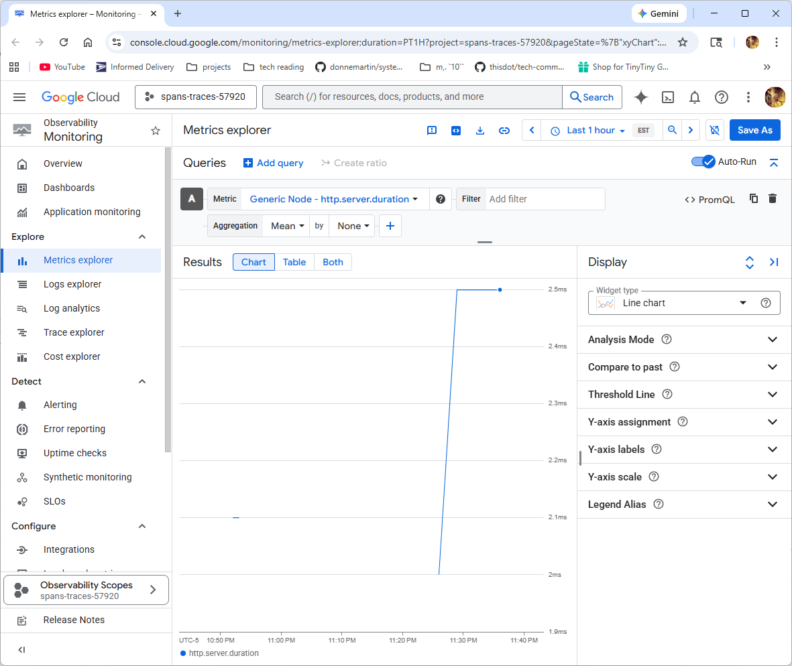

# Overview
This repo seeks to send trace data to *some* cloud.  All of the guides feel really complicated and 
the cloud providers want you to run collectors in their infra (ie, spin up a GKE cluster with an app and collectors across 3 AZs to see how things work).  We're doing away with some of that "production ready" nature to zero in on the components and how they interact. 

## Guides
https://opentelemetry.io/docs/languages/python/getting-started/

https://github.com/open-telemetry/opentelemetry-collector-contrib/blob/main/exporter/googlecloudexporter/README.md


## Pricing
$0.20/million spans - https://cloud.google.com/stackdriver/pricing#trace-pricing-summary

# Python app that sends spans to Google Cloud Trace
Remember to create a service account per the collector exporter for GCP in the readme above.

## App
```
export OTEL_PYTHON_LOGGING_AUTO_INSTRUMENTATION_ENABLED=true
opentelemetry-instrument --logs_exporter otlp flask run -p 8080 --host 0.0.0.0
```

## Collector
```
podman run -p 55681:55681 \
    -p 4317:4317 \
    --rm \
    -v `pwd`/otel-collector-config-gcp.yaml:/etc/otel-collector-config.yaml \
    -v `pwd`/../secrets/service-account-key.json:/etc/otelcol-contrib/key.json \
    --env GOOGLE_APPLICATION_CREDENTIALS=/etc/otelcol-contrib/key.json \
    docker.io/otel/opentelemetry-collector-contrib:nightly-amd64 \
    --config=/etc/otel-collector-config.yaml
```

## UI


## Ongoing demo work:
https://github.com/open-telemetry/opentelemetry-collector-contrib/blob/main/exporter/googlemanagedprometheusexporter/README.md is a connector to turn spans into metrics, and export those.  There are some errors coming from the collector, and I need to get that running with a more standart Prometheus instance.  But there seems to be something here.


# Historical details, working up to the app
## Basic App
`flask run -p 8080 --host 0.0.0.0`

### Instrumented
```
export OTEL_PYTHON_LOGGING_AUTO_INSTRUMENTATION_ENABLED=true
opentelemetry-instrument \
    --traces_exporter console \
    --metrics_exporter console \
    --logs_exporter console \
    --service_name dice-server \
    flask run -p 8080 --host 0.0.0.0
```

## App with export to collector (dumping to console)

### App
```
export OTEL_PYTHON_LOGGING_AUTO_INSTRUMENTATION_ENABLED=true
opentelemetry-instrument --logs_exporter otlp flask run -p 8080 --host 0.0.0.0
```

### Collector
```
podman run -p 4317:4317 \
    -v `pwd`/otel-collector-config-console.yaml:/etc/otel-collector-config.yaml \
    docker.io/otel/opentelemetry-collector:latest \
    --config=/etc/otel-collector-config.yaml
```

# License
This repository contains code licensed under Creative Commons Attribution 4.0 International and Apache 2.0.  